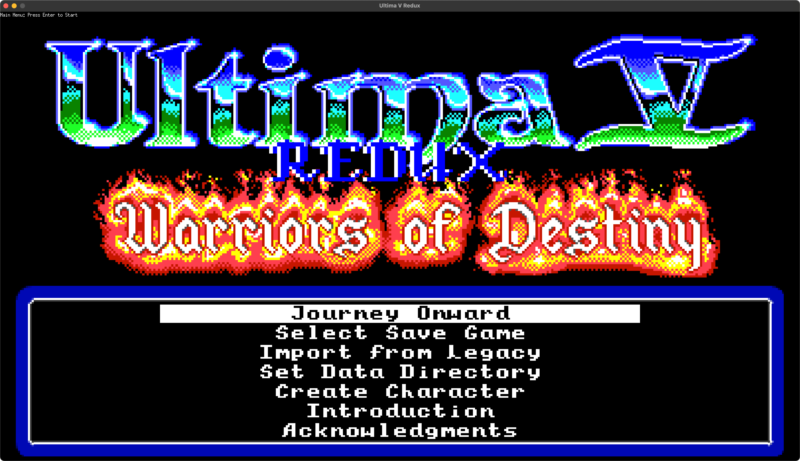
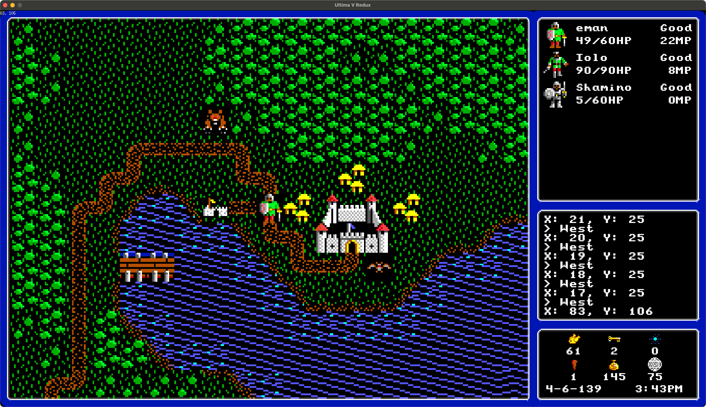

# Ultima 5 Redux


A faithful recreation of the legendary RPG **Ultima V: Warriors of Destiny** (1988), bringing Lord British's masterpiece to modern systems.



## About the Game

**Ultima V: Warriors of Destiny** is widely considered one of the greatest RPGs ever made. Set in the fantasy world of Britannia, you play as the Avatar returning to find the land under the iron rule of the tyrant Blackthorn. The eight virtues you once championed have been twisted into a harsh code of law, and your friends scattered to the winds.

This remake preserves everything that made the original special:
- **Deep moral choices** that shape the story
- **Living world** where NPCs follow daily schedules  
- **Rich dialogue system** with hundreds of characters to meet
- **Tactical combat** against monsters and guards
- **Magic system** with dozens of spells to master
- **Exploration** across towns, dungeons, and the vast overworld

### What Works Now

- 🏰 **Explore Britannia**: Walk through iconic locations like Britain, Trinsic, and Buccaneer's Den
- 💬 **Talk to Everyone**: Full conversation system with all original NPCs and dialogue
- ⚔️ **Adventure Commands**: Open doors, search areas, push objects, jimmy locks
- 🌅 **Living World**: Day/night cycles and NPCs with realistic schedules
- 🗺️ **Navigate Freely**: Travel between towns, dungeons, and the overworld map

### Coming Soon

- ⚔️ Combat system completion
- ✨ Full magic and spell system  
- 💾 Save/load your progress
- 🏴‍☠️ Complete quest system

## How to Play

### What You Need

- A computer running Windows, Mac, or Linux
- Original Ultima V data files (you must own the original game)
- About 50MB of disk space

### Getting the Game

1. **Download**: Clone or download this repository
2. **Install Go**: Download from [golang.org](https://golang.org) (needed to build the game)
3. **Build**: Run these commands in a terminal:
   ```bash
   git clone https://github.com/bradhannah/Ultima5ReduxGo.git
   cd Ultima5ReduxGo
   go build -o bin/ultimav ./cmd/ultimav
   ```
4. **Play**: Run `./bin/ultimav` (or `bin/ultimav.exe` on Windows)

### Game Controls

- **Arrow Keys**: Move your character
- **Enter**: Confirm actions and advance dialogue
- **A-Z Keys**: Use game commands (Look, Talk, Open, etc.)
- **Escape**: Access game menu

Try these essential commands:
- **L**ook - Examine your surroundings
- **T**alk - Speak with NPCs  
- **O**pen - Open doors and chests
- **G**et - Pick up items

## Screenshots



*Exploring the overworld of Britannia - complete with party status, inventory, and the iconic Lord British's castle*

## FAQ

**Q: Do I need the original Ultima V to play this?**  
A: Yes, you need the original game's data files. This remake doesn't include the copyrighted assets.

**Q: Will my original Ultima V save files work?**  
A: Save file support is planned but not yet implemented. You'll start fresh for now.

**Q: How complete is this remake?**  
A: The core exploration and dialogue systems are fully playable. Combat and magic systems are still in development.

**Q: Can I contribute to the project?**  
A: Absolutely! Check out the `docs/` folder for development guidelines, or open an issue to discuss features.

## The Story So Far

Years have passed since you proved yourself as the Avatar and established the eight virtues throughout Britannia. But something has gone terribly wrong. Lord British has vanished, and the kingdom now lies under the harsh rule of Blackthorn, who has twisted the virtues into a rigid code of laws.

Your old companions have been scattered:
- **Iolo** hides in the deep woods
- **Shamino** has fled to a distant island  
- **Dupre** leads a resistance from the sewers
- Others have gone into exile or worse

The people suffer under oppressive laws where small transgressions lead to imprisonment or death. Ancient shrines lie abandoned, and a mysterious organization called the "Oppression" enforces Blackthorn's will with an iron fist.

As the Avatar, you must reunite your companions, rediscover the true meaning of virtue, and find a way to restore balance to Britannia - all while avoiding the watchful eyes of Blackthorn's guards.

## For Developers

Want to contribute? This project is built in Go with extensive documentation:
- See `docs/CODING_CONVENTIONS.md` for code standards  
- Run tests with `go test ./...`
- Architecture details in `docs/` directory

## License

This project is a fan recreation and educational exercise. It requires original Ultima V data files to function. Please ensure you own a legal copy of Ultima V before using this software.

## Acknowledgments

- **Origin Systems** - For creating the original Ultima V
- **Richard Garriott (Lord British)** - Creator of the Ultima series
- The Ultima community for preservation efforts and documentation